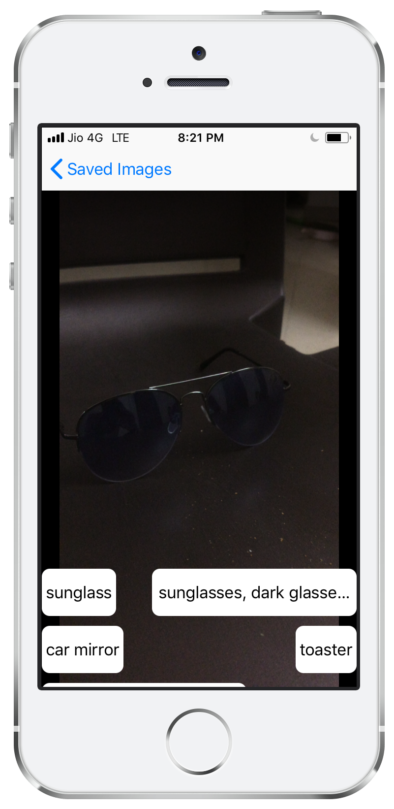

# FindIt


## Origin
This app is my Capstone project for the iOS Developer Nanodegree offered by Udacity. This Nanodegree course focuses on iOS app development using Swift, including UIKit Fundamentals, Networking, and Persistence with Code Data.

## About the App
FindIt is an iOS app that let users use their camera to detect objects and then find related images using Flickr APIs.
The details of the screens are as follows:

| Screen        | Usage | Screenshot |
| ------------- | ----- | ---------- |
| Home Screen   | This the first screen appearing to the user. The user can see the saved photos, delete them or open camera to search for new images. | 
| Camera Screen | This screen has a live feed from Camera. It shows the suggested tags at bottom and updates automatically according to camera feed. The user then can click on one of the recommended cards to search images for that tag. | 
| Photos Screen | In this screen, the user can see the tag related photos, save them in the app or share using other application. | 

## Libraries and Frameworks Used
**iOS Frameworks**:
1. [Foundation](https://developer.apple.com/documentation/foundation)
2. [UIKit](https://developer.apple.com/documentation/uikit)
3. [Core Data](https://developer.apple.com/documentation/coredata) to store images.
4. [AVFoundation](https://developer.apple.com/av-foundation/) to grab video from Camera.
5. [Vision](https://developer.apple.com/documentation/vision) to recognise objects from live video feed.

**External Library**
6. [Kingfisher](https://github.com/onevcat/Kingfisher) to load images from network.

## How to Build
The build system uses [CocoaPods](https://cocoapods.org) to integrate dependencies. You should be familiar with CocoaPods and API key and secret from Flickr account.
1. Download zip or fork & clone project on your desktop.
2. Open Terminal and `cd` into project folder. Most of the times the path will be `~/Downloads/FindIt`.
3. Run `pods install` to install dependencies.
4. Open `FindIt.xcworkspace`, it will open in Xcode.
5. Now, Open `Constants.swift` file and put the appropriate keys in it. You can find the keys using [this guide](https://www.flickr.com/services/api/misc.api_keys.html)
6. Download the Machine Learning model [Resnet50.mlmodel](https://docs-assets.developer.apple.com/coreml/models/Resnet50.mlmodel) and place it in `<RootProject>/FindIt` directory. _To avoid confusion: The model should be place along with the Swift files._
7. Now you can build and run.

> Note: This app uses the camera, so you will have to run it on Real Device. You may need to make changes in the signing certificate.

## Licence

```
This project was submitted by Shailesh Aher as part of the iOS Developer Nanodegree At Udacity.
As part of Udacity Honor code, your submissions must be your work, hence submitting this project
as yours will cause you to break the Udacity Honor Code moreover, the suspension of your account.
Me, the author of the project, allows you to check the code as a reference, but if you submit it,
it is your responsibility if you get expelled.
Besides the above notice, the following license applies, and this license notice must be included
in all works derived from this project.

MIT License

Copyright (c) 2018 Shailesh Aher

Permission is hereby granted, free of charge, to any person obtaining a copy of this software
and associated documentation files (the "Software"), to deal in the Software without restriction,
including without limitation the rights to use, copy, modify, merge, publish, distribute,
sublicense, and/or sell copies of the Software, and to permit persons to whom the Software is
furnished to do so, subject to the following conditions:

The above copyright notice and this permission notice shall be included in all copies or
substantial portions of the Software.

THE SOFTWARE IS PROVIDED "AS IS", WITHOUT WARRANTY OF ANY KIND, EXPRESS OR IMPLIED, INCLUDING BUT
NOT LIMITED TO THE WARRANTIES OF MERCHANTABILITY, FITNESS FOR A PARTICULAR PURPOSE AND
NONINFRINGEMENT. IN NO EVENT SHALL THE AUTHORS OR COPYRIGHT HOLDERS BE LIABLE FOR ANY CLAIM,
DAMAGES OR OTHER LIABILITY, WHETHER IN AN ACTION OF CONTRACT, TORT OR OTHERWISE, ARISING FROM,
OUT OF OR IN CONNECTION WITH THE SOFTWARE OR THE USE OR OTHER DEALINGS IN THE SOFTWARE.
```
